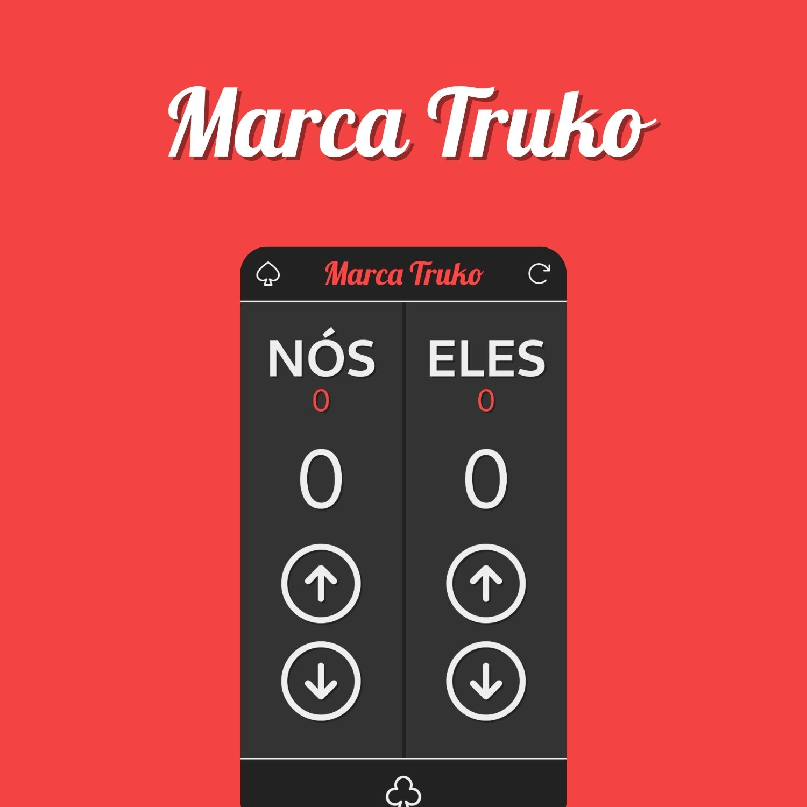

<h1 align="center"> Marca Truko </h1>

  <a href="#-technologies">Technologies</a>&nbsp;&nbsp;&nbsp;|&nbsp;&nbsp;&nbsp;
  <a href="#-project">Project</a>&nbsp;&nbsp;&nbsp;|&nbsp;&nbsp;&nbsp;
  <a href="#memo-license">License</a>

  

 

  

## 🚀 Technologies

This project was developed with the following technologies:

- HTML and CSS
- JavaScript
- Git and GitHub
- Tailwind CSS

## 💻 Project

The Marca Truko is a project that marks the scores of your truco matches.

## :memo: License

This project is under the GPL-3.0 license. See the [LICENSE](LICENSE) file for more details.
